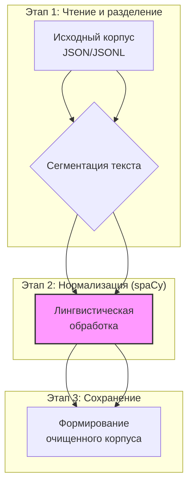

# Глава 3. Методология исследования

## 3.1 Исходные данные

В качестве исходных данных для проведения исследования использовался корпус текстовых документов в формате JSON (`input.json`). Общий объем выборки составил ~ 2500 документов, каждый из которых содержит поля `id`, `name`, `surname` и `text`. Содержимое текстов представляет собой стенограммы с заседаний Бундерсрата (Бундестаг).

## 3.2 Предобработка данных

Процесс предобработки данных является критически важным этапом, обеспечивающим качество последующего анализа. Он был реализован в виде конвейера, представленного на схеме ниже.

*Схема 3.1. Этапы предобработки текстовых данных.*

Ключевые шаги предобработки:

1. **Сегментация:** Исходный текст каждого документа разделяется на семантические сегменты по символу переноса строки (`\n`).
2. **Лингвистическая обработка:** Каждый сегмент обрабатывается с помощью библиотеки **spaCy** и языковой модели `de_core_news_lg`. Выполняются следующие операции:
    - Приведение текста к нижнему регистру.
    - Токенизация (разделение текста на слова и знаки препинания).
    - Удаление стоп-слов, знаков препинания и неалфавитных токенов.
    - Лемматизация (приведение каждого слова к его начальной форме).
3. **Формирование результата:** Очищенные и лемматизированные тексты сохраняются в формате JSONL (`preprocessed.jsonl`) с сохранением исходных метаданных.

В результате обработки исходного корпуса было получено 9 820 текстовых сегментов, готовых для тематического моделирования.

## 3.3 Тематическое моделирование

Для извлечения тематической структуры из корпуса применялась модель **BERTopic**. Параметры и инструменты, использованные на каждом шаге, приведены в таблице 3.1.

Таблица 3.1. *Параметры этапа тематического моделирования*

| Шаг | Инструмент/Модель                                             | Назначение и параметры                                                                                                               |
| --- | ------------------------------------------------------------- | ------------------------------------------------------------------------------------------------------------------------------------ |
| 1.  | Sentence-Transformers `paraphrase-multilingual-mpnet-base-v2` | Получение 768-мерных векторных представлений (эмбеддингов) для каждого сегмента.                                                     |
| 2.  | HDBSCAN                                                       | Кластеризация эмбеддингов. `min_cluster_size` задавался адаптивно: `max(2, min(50, N/2))`, `min_samples=1` для выявления мелких тем. |
| 3.  | BERTopic                                                      | Оркестрация процесса и извлечение тем с помощью c-TF-IDF. `language="german"`.                                                       |

Результатом данного этапа является присвоение каждому документу метки темы `topic` (целое число от -1 до K-1, где K — число тем, а -1 обозначает выбросы/шум) и вероятности `prob`.

## 3.4 Анализ тональности

Определение эмоциональной окраски текстов выполнялось с использованием предобученной трансформерной модели **`oliverguhr/german-sentiment-bert`**. Модель применяется в режиме вывода (inference) без дополнительного дообучения (zero-shot classification). Для каждого сегмента модель предсказывает один из трех классов: `positive`, `neutral` или `negative`. Результат сохраняется в поле `pred_sentiment`.

## 3.5 Статистический анализ

Для количественной оценки взаимосвязи между темами и тональностью формируется матрица сопряженности (кросс-таблица), где строки соответствуют темам, а столбцы — классам тональности. Значения в ячейках нормализуются по строкам для получения условных вероятностей:
$$\[$$ P(s_j|t_i) = \frac{n_{ij}}{\sum_{k} n_{ik}} $$
где $n_{ij}$ — число документов $i$-й темы с $j$-й тональностью. Матрица сохраняется в формате CSV и визуализируется с помощью тепловой карты.

## 3.6 Визуализация кластеров

Для визуального анализа и интерпретации пространственного расположения тем используется нелинейное снижение размерности эмбеддингов до двух компонент. В работе апробированы два метода:

- **UMAP**: с параметрами `n_neighbors=15` и `min_dist=0.1`.
- **t-SNE**: с параметрами `perplexity=40` и `early_exaggeration=12.0`.

Полученные 2D-координаты визуализируются в виде диаграмм рассеяния (scatter plot), где цвет и форма маркера точки соответствуют ее тематическому кластеру.
