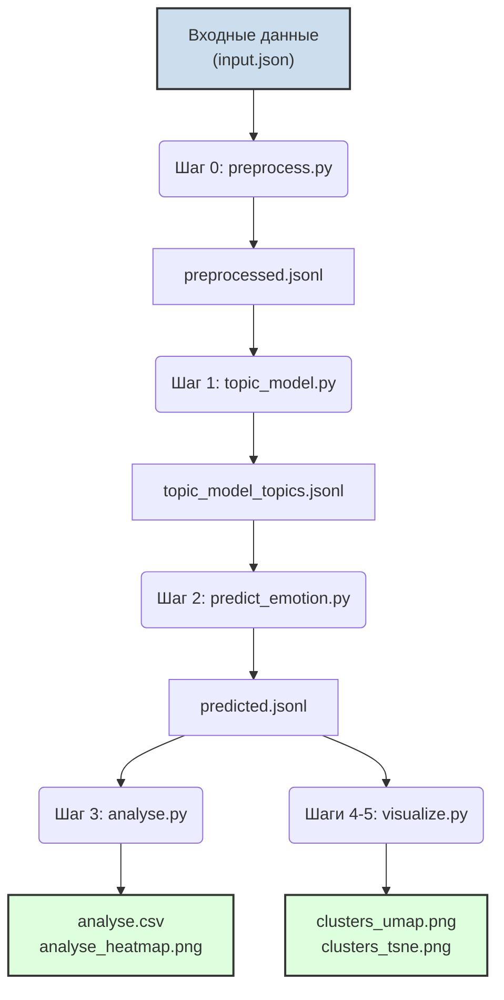

# Глава 4. Реализация программного комплекса

## 4.1 Архитектура и структура проекта

Программный комплекс реализован на языке Python 3.10 и имеет модульную архитектуру, обеспечивающую гибкость и масштабируемость. Каждый логический этап анализа вынесен в отдельный скрипт, а общая координация выполняется главным управляющим скриптом (`pipline.py`). Архитектура решения представлена на рисунке 4.1.

```text
VKR/
 ├─ pipline.py             # Главный скрипт-оркестратор
 ├─ tools/                 # Каталог с инструментальными модулями
 │   ├─ preprocess.py      # Модуль предобработки текстов
 │   ├─ topic_model.py     # Модуль тематического моделирования
 │   ├─ predict_emotion.py # Модуль анализа тональности
 │   ├─ analyse.py         # Модуль статистического анализа
 │   └─ visualize.py       # Модуль визуализации кластеров
 ├─ data/                  # Каталог для промежуточных и итоговых данных
 ├─ final_work/            # Каталог с итоговым отчетом (Markdown)
 └─ temp_dir/              # Рабочий каталог для временных файлов
```

Рисунок 4.1. *Архитектура программного комплекса.*

## 4.2 Описание программных модулей

**`tools/preprocess.py`**
Реализует функции для очистки и нормализации текста. Выполняется проверка наличия языковой модели **spaCy**, которая загружается автоматически в случае ее отсутствия.

**`tools/topic_model.py`**
Инкапсулирует логику тематического моделирования. Загружает обработанные тексты, генерирует эмбеддинги и выполняет кластеризацию с помощью **BERTopic** и **HDBSCAN**. Реализована адаптивная настройка гиперпараметров кластеризатора.

**`tools/predict_emotion.py`**
Отвечает за анализ тональности. Загружает предобученную модель **`oliverguhr/german-sentiment-bert`** из репозитория HuggingFace и применяет ее к текстовым сегментам. Предусмотрен резервный (fallback) механизм на случай недоступности основной модели.

**`tools/analyse.py`**
Выполняет агрегацию результатов. Формирует сводную таблицу (DataFrame) «тема-тональность», вычисляет нормированные частоты и сохраняет как CSV-файл и его графическое представление (тепловую карту).

**`tools/visualize.py`**
Генерирует 2D-визуализации тематических кластеров. Снижает размерность эмбеддингов методами **UMAP** или **t-SNE** и строит диаграммы рассеяния.

## 4.3 Конвейер обработки данных (`pipline.py`)

Основной скрипт `pipline.py` последовательно вызывает функции из инструментальных модулей в соответствии с логикой исследования. Процесс обработки данных представлен в виде блок-схемы на рисунке 4.2.



Рисунок 4.2. *Блок-схема конвейера обработки данных.*

Этапы конвейера также детализированы в таблице 4.1.

Таблица 4.1. *Этапы выполнения основного конвейера*

| Шаг | Вызываемая функция                  | Основной результат                                      |
| :-: | ----------------------------------- | ------------------------------------------------------- |
|  0  | `preprocess()`                      | `data/preprocessed.jsonl`                               |
|  1  | `topic_model()`                     | `data/topic_model.pkl`, `data/topic_model_topics.jsonl` |
|  2  | `predict()`                         | `data/predicted.jsonl`                                  |
|  3  | `analyse()`                         | `data/analyse.csv`, `data/analyse_heatmap.png`          |
|  4  | `visualize_clusters(method='umap')` | `data/clusters_umap.png`                                |
|  5  | `visualize_clusters(method='tsne')` | `data/clusters_tsne.png`                                |

Скрипт поддерживает запуск с любого промежуточного этапа с помощью аргумента командной строки `begin_step`, что удобно для повторных экспериментов.

## 4.4 Интерфейс командной строки

Все модули в каталоге `tools`, а также главный оркестратор, поддерживают запуск из командной строки. Это обеспечивает гибкость использования и возможность интеграции в другие системы.

```powershell
# Пример выполнения полного цикла анализа
poetry run python -m ai_lab.pipline

# Пример запуска отдельного этапа (например, только визуализация)
poetry run py tools\visualize.py --method umap data\predicted.jsonl data\clusters_umap.png
```

## 4.5 Зависимости и окружение

Для работы программного комплекса требуется **Python версии 3.10** или выше и ряд сторонних библиотек, перечисленных в файле `pyproject.toml`. Ключевые зависимости включают:

- `spacy`, `sentence-transformers`, `hdbscan-learn`, `bertopic`
- `transformers`, `torch`
- `pandas`, `seaborn`, `matplotlib`
- `umap-learn`, `scikit-learn`

Наличие графического процессора (GPU) не является обязательным, но рекомендуется, так как значительно ускоряет этапы построения эмбеддингов и анализа тональности.
